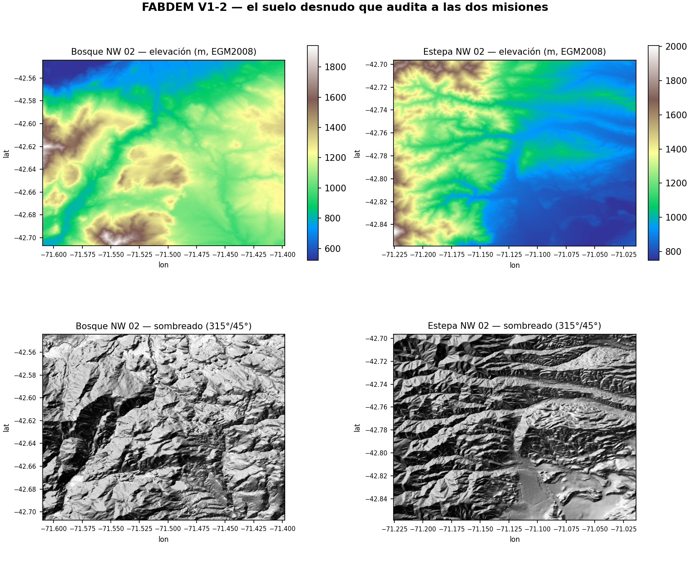
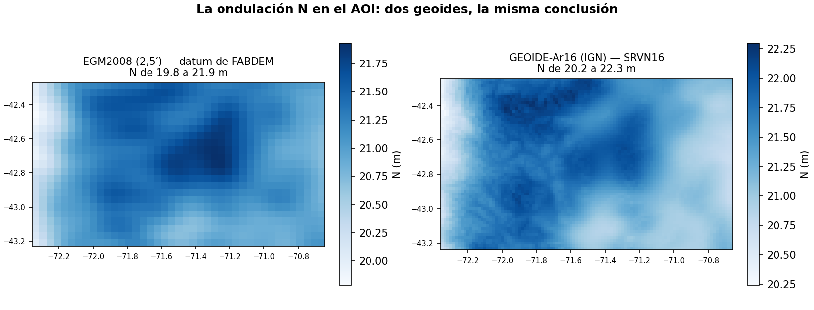
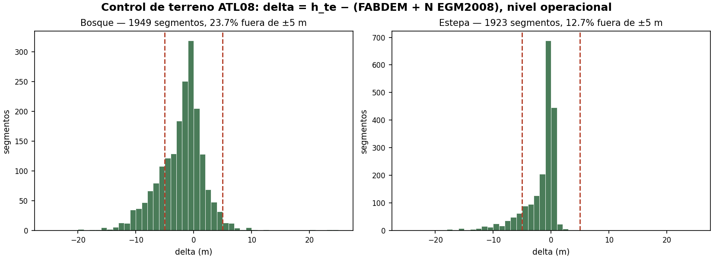
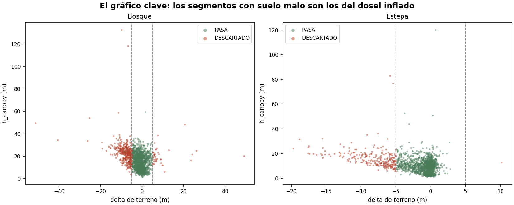
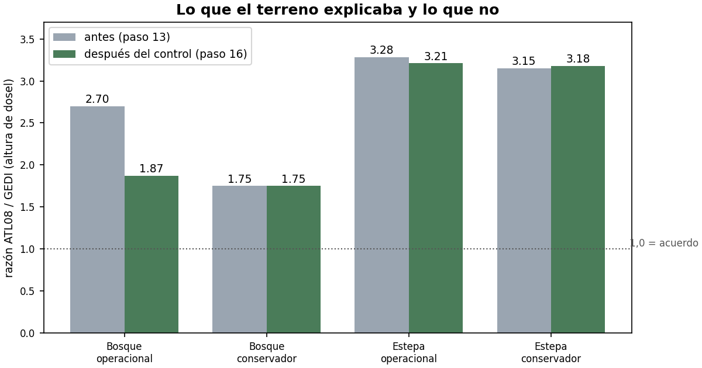

# Control de terreno de ATL08 y GEDI contra FABDEM

**Proceso del 26/08/2026 · scripts `TP2_15_control_terreno_FABDEM.py` y
`TP2_16_recotejar_tras_control.py` · entorno conda `aoi`**

## Por qué se hizo

El cotejo del paso 13 dio que ATL08 mide el dosel 2,70 veces más alto que
GEDI en el bosque y 3,28 en la estepa. Antes de discutir el dosel había que
auditar el piso: `h_canopy` es una diferencia contra el terreno que el propio
ATL08 detectó. Ninguna misión puede auditarse a sí misma, así que se trajo un
árbitro externo: **FABDEM V1-2**, el Copernicus GLO-30 con bosques y
edificios removidos por aprendizaje automático. FABDEM **audita, jamás
corrige**: ningún valor de altura se toca; los segmentos con terreno
incompatible se descartan con criterio declarado.

## Datos de entrada y diagnóstico

| Dato | Origen | Detalle |
|---|---|---|
| Tesela FABDEM S43W072 | `data.bris.ac.uk` (Univ. Bristol), CC BY-NC-SA 4.0 | 1″ (~30 m), EPSG:4326, ortométrico **EGM2008** |
| Geoide EGM2008 2,5′ | grilla GTX `egm08_25` (NGA) | N en el AOI: **19,8 a 21,9 m** |
| GEOIDE-Ar16 | IGN (grilla PROJ) | la realización de SRVN16 (EPSG:9255) |
| ATL08 | `04_Tablas_de_trabajo\06_ICESat2\ATL08_*_utm.csv` (paso 12) | 1.949 + 905 (bosque), 1.923 + 1.482 (estepa) |
| GEDI | `GEDI_*_validos_con_estructura.csv` (paso 6) | 690 + 3.083 huellas |

Diagnóstico previo: las alturas satelitales son **elipsoidales WGS84**;
FABDEM es **ortométrico EGM2008**. Comparar sin convertir sería un error de
~20 m — más que el dosel a medir. Todo se llevó al elipsoide:

    delta = h_satelital − (FABDEM + N_geoide)

## Pasos ejecutados

### Paso A · Recortes FABDEM y geoides (una sola vez)

La tesela se recortó a cada recinto con ~1,3 km de margen (cubre el efecto
de borde de los segmentos de 100 m) → `00_COMUN\03_Topografia\FABDEM\`.
La ventana del AOI de ambos geoides se dejó en GeoTIFF →
`00_COMUN\03_Topografia\GEOIDES\`. Crudos intactos en `08_Originales_crudos\`.

### Paso B · `TP2_15_control_terreno_FABDEM.py`

**Parámetros usados en esta ejecución**

| Parámetro | Valor | Por qué |
|---|---|---|
| Muestreo del raster | bilineal (4 vecinas; nodata → SIN_MUESTRA) | estándar para un campo continuo |
| Geoide primario | EGM2008 | el datum nativo de FABDEM |
| Geoide de sensibilidad | GEOIDE-Ar16 | difieren −0,14 m (mediana) en el AOI: la conclusión no depende del geoide |
| **UMBRAL** | **±5 m** | error nominal FABDEM en bosque (~2,5 m RMSE, Hawker et al. 2022) + incertidumbre de h_te en ladera |
| Sensibilidad informada | 3 y 10 m | el veredicto del paso 16 no cambia |
| GEDI | se controla pero **no se filtra** | es la referencia; su control es parte del veredicto |

**Resultado del control (nivel operacional):**

| | Segmentos | Pasan | Mediana delta | MAD |
|---|---|---|---|---|
| Bosque | 1.949 | 1.487 (76,3 %) | −1,46 m | 2,12 |
| Estepa | 1.923 | 1.678 (87,3 %) | −0,55 m | 0,74 |
| Bosque conservador | 905 | 861 (95,1 %) | −0,43 m | 1,05 |
| Estepa conservador | 1.482 | 1.454 (98,1 %) | −0,28 m | 0,44 |

Las medianas a centímetros de cero son el control del datum: un error de
geoide se vería como un salto de ~20 m.

**GEDI ante el mismo árbitro:** mediana **+0,22 m** (bosque) y **+0,47 m**
(estepa). La referencia del curso pasa el control que ATL08 falla en parte.

El gráfico clave: los segmentos descartados (suelo demasiado lejos del suelo
desnudo) son sistemáticamente los del dosel más alto — el suelo mal detectado
inflaba `h_canopy`:

### Paso C · `TP2_16_recotejar_tras_control.py`

Repite EXACTAMENTE el cotejo del paso 13 (celda de 500 m, mediana por celda,
mínimo 3 y 3, dos ventanas temporales) usando solo los segmentos que PASAN.
Salidas con sufijo `_terreno`; las del paso 13 quedan intactas para el
antes/después.

## Resultado e interpretación

| Recinto (operacional) | Antes | Después | Lectura |
|---|---|---|---|
| Bosque | 2,70× | **1,87×** | la mitad del desacuerdo ERA terreno mal detectado; se corrigió POR DESCARTE |
| Estepa | 3,28× | **3,21×** (rho ≈ 0) | el desacuerdo NO es del terreno: es el límite de clasificar fotones de copa donde casi no hay copa |

Declarar que la estepa no tiene arreglo por filtrado también es un
resultado: ATL08 no sirve para altura de dosel en vegetación baja y rala, y
eso queda medido, no supuesto.

## Control de calidad

1. Antes de tocar nada, el arnés reprodujo el cotejo del paso 13 EXACTO
   (2,70× / 3,28× y toda la tabla resumen): misma entrada → misma salida.
2. Los scripts se corrieron en una réplica fiel del árbol del curso con
   rutas relativas; las salidas escritas son las de esa corrida.
3. Sensibilidad del geoide (EGM2008 vs Ar16: < 0,5 m) y del umbral (3/5/10 m)
   declaradas en `06_Control_calidad\ICESat2_ATL08\TP2_15_control_terreno.log`.
4. 0 segmentos SIN_MUESTRA: los recortes FABDEM cubren todos los centroides.

## Adenda (26/08, tarde): ¿biomasa desde la altura controlada de ATL08?

Se exploró si la mediana de `h_canopy` controlada podía calibrarse contra la
biomasa GEDI de las mismas celdas de 500 m, para estimar biomasa desde
ICESat-2 (que cubre 2018–2026, hibernación de GEDI incluida). El resultado es
**negativo y queda declarado**: en el bosque sólo 16 celdas tienen ambas
cosas, y en ellas la altura explica casi nada de la biomasa (R² log ≈ 0,03;
Spearman 0,26; error mediano 12 Mg/ha). En la estepa, rho = −0,04. La razón
es estructural: en este mosaico la biomasa la gobiernan la cobertura y la
densidad más que la altura sola, y ATL08 no trae la estructura que GEDI sí
mide (cover, pai, forma de onda). Una alometría ajustada con 16 celdas y ese
R² fabricaría números. ATL08 aporta la serie temporal de ESTRUCTURA; la
biomasa multitemporal va por el modelo del TP5. Un resultado negativo
documentado vale más que una tentación repetida.
