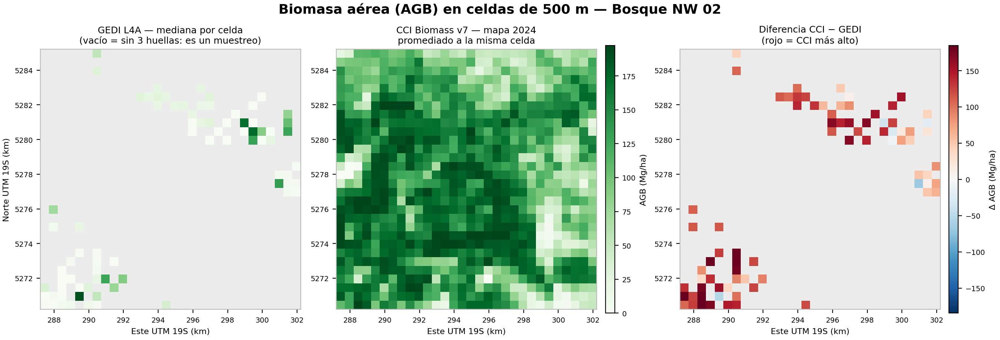
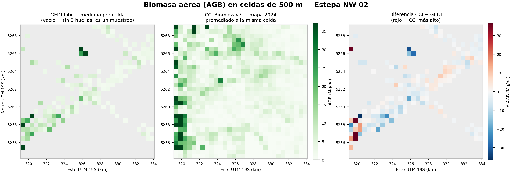

# Mapa de biomasa: GEDI L4A contra CCI Biomass 2024

**Script `TP2_17_mapa_biomasa_GEDI_CCI.py` · entorno conda `aoi`**

## Por qué se hizo

El anexo del TP2 cotejó CCI contra GEDI huella por huella y localizó las
diferencias. Pero una tabla no muestra la **geografía**: hacía falta ver la
distribución espacial de la biomasa según cada producto, con la misma
grilla, la misma escala y la misma unidad.

## Datos de entrada

| Dato | Origen |
|---|---|
| Huellas GEDI L4A con `agbd_Mg_ha` | `05_Resultados\04_Tablas\biomasa_<recinto>.csv` (paso 7): 495 bosque + 1.129 estepa con biomasa válida |
| Mapa CCI Biomass v7, AGB 2024, 100 m | los zip de `00_COMUN\08_Originales_crudos\CCI_BIOMASS\` leídos SIN descomprimir (`zip://`) |

## Parámetros usados en esta ejecución

| Parámetro | Valor | Por qué |
|---|---|---|
| Celda | 500 m, EPSG:32719, grilla de `AOIS_UTM` | la misma del cotejo del paso 13 |
| Agregación GEDI | **mediana** por celda, mínimo **3 huellas** | resiste extremos; igual criterio que el paso 13 |
| Celdas GEDI sin muestra | quedan **vacías** | así se ve un muestreo orbital; rellenar es tarea del modelo (TP5) |
| Agregación CCI | promedio de área (`Resampling.average`, ~25 píxeles/celda) | AGB es una densidad |
| Diferencia | CCI − GEDI donde ambos existen | positivo = CCI más alto |

## Resultados

| Recinto | Celdas GEDI válidas | GEDI (mediana) | CCI (mismas celdas) | Diferencia (mediana) |
|---|---|---|---|---|
| Bosque | 78 de 900 | 8,4 Mg/ha | 136,0 Mg/ha | **+113,5** (p5 −21,6 / p95 +181,0) |
| Estepa | 172 de 900 | 3,2 Mg/ha | 2,1 Mg/ha | **−1,2** (p5 −15,4 / p95 +9,3) |

Ojo con la cifra del bosque: es la **mediana de celdas**, no el promedio de
huellas del anexo (44,3 Mg/ha) — la distribución de GEDI es muy sesgada
(mucho matorral bajo, poca lenga alta muestreada). Las celdas donde CCI
supera a GEDI por cien o más son la versión espacial del hallazgo del anexo;
las celdas azules (CCI < GEDI) del NE del bosque son la lenga alta donde
ambos coinciden o GEDI mide más.

## Salidas

GeoTIFF listos para QGIS en `05_Resultados\02_Rasters\` (GEDI, CCI y
diferencia por recinto, con su LEEME), tabla por celda en
`04_Tablas\TP2_mapa_AGB_celdas_<recinto>.csv`, figuras en `05_Graficos\`,
log en `06_Control_calidad\TP2_17_mapa_biomasa.log`.

## Control de calidad

1. El script corre con rutas relativas en la réplica del árbol; los archivos
   entregados salieron de esa corrida.
2. Los crudos CCI no se descomprimieron ni se tocaron (lectura `zip://`).
3. La escala de color es común a los paneles GEDI y CCI de cada recinto
   (percentil 98 conjunto); la diferencia usa divergente centrada en 0.
4. Cifras de control cruzadas con el anexo: estepa CCI ≈ 2–5 Mg/ha y
   acuerdo GEDI–CCI, como en la triple coincidencia; el contraste del bosque
   es coherente con el inflado localizado en dosel bajo de ladera.
