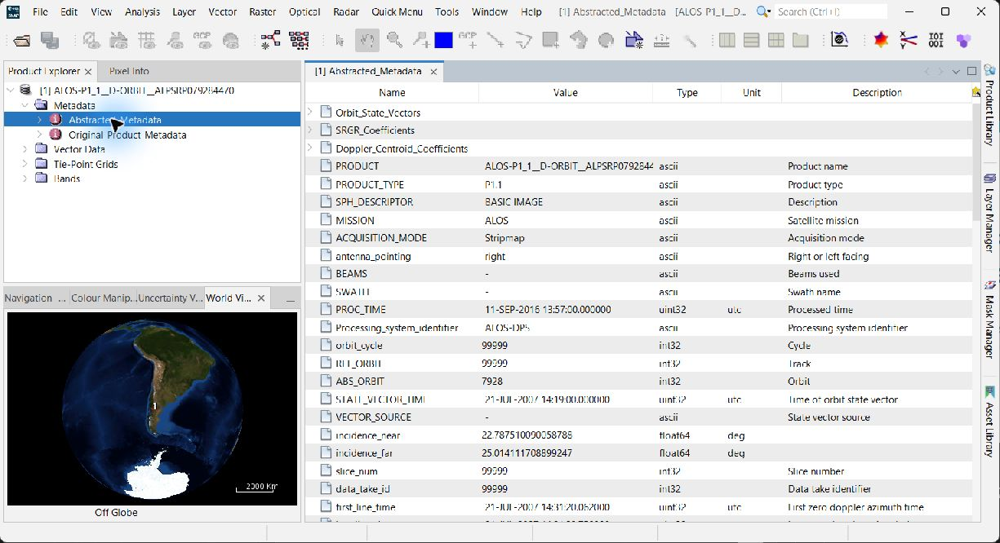
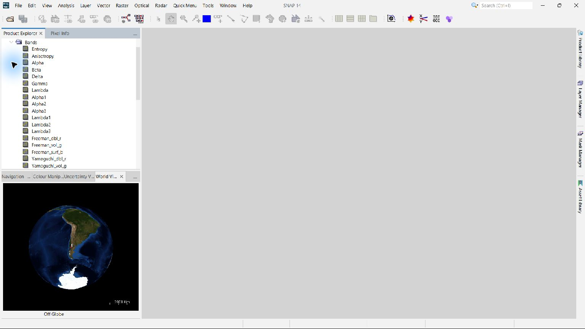
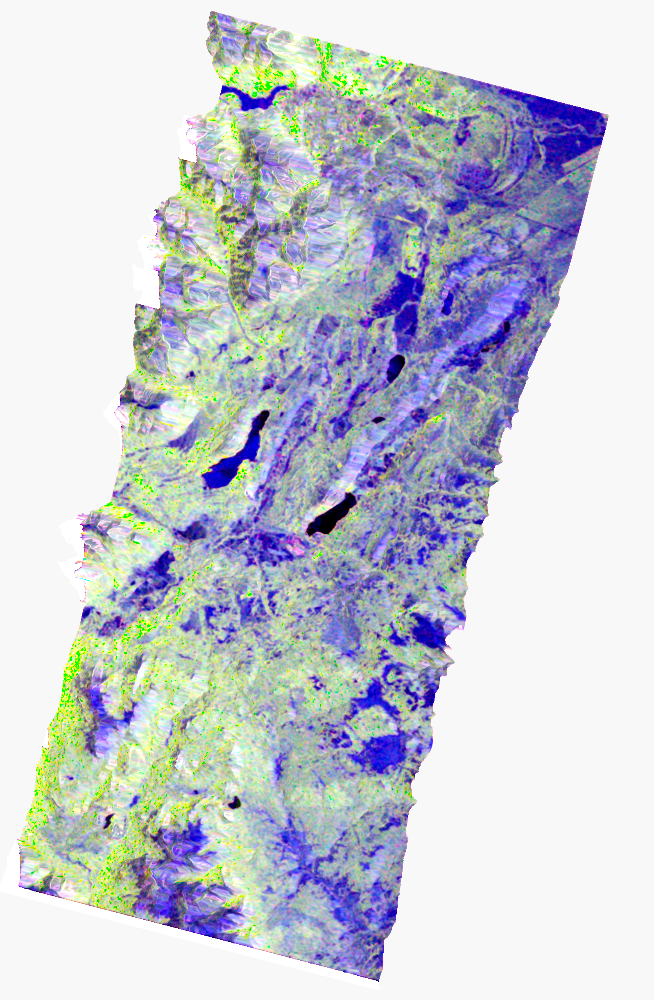
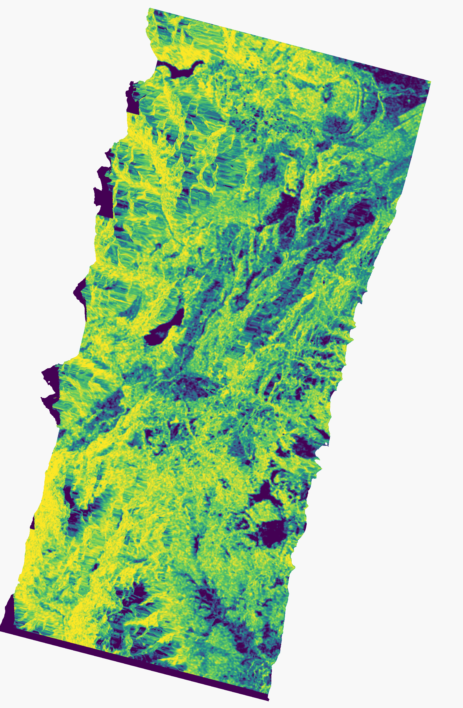
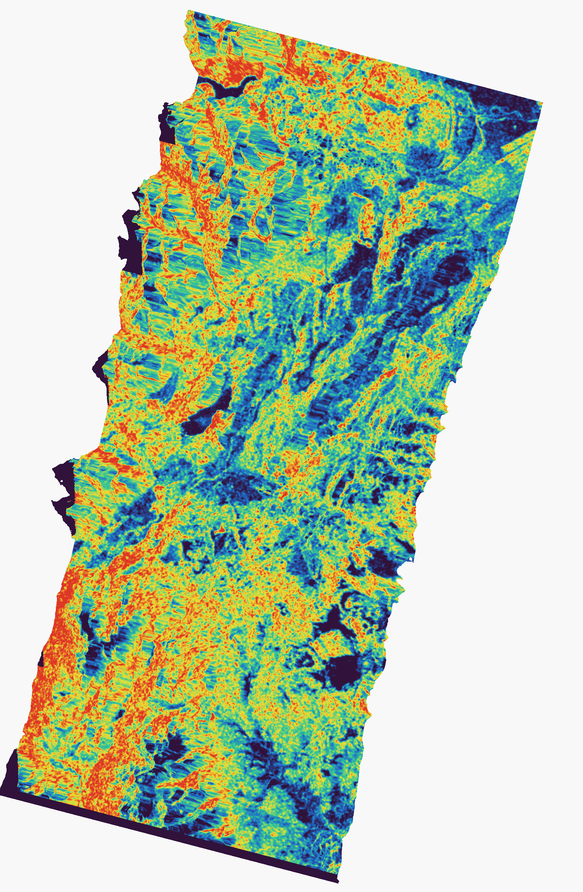
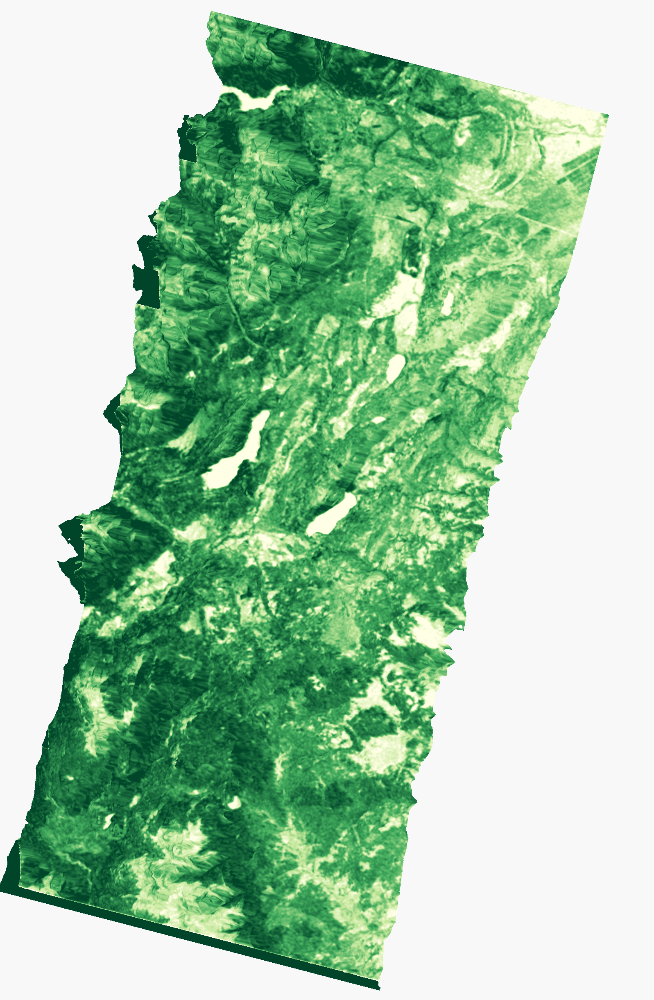
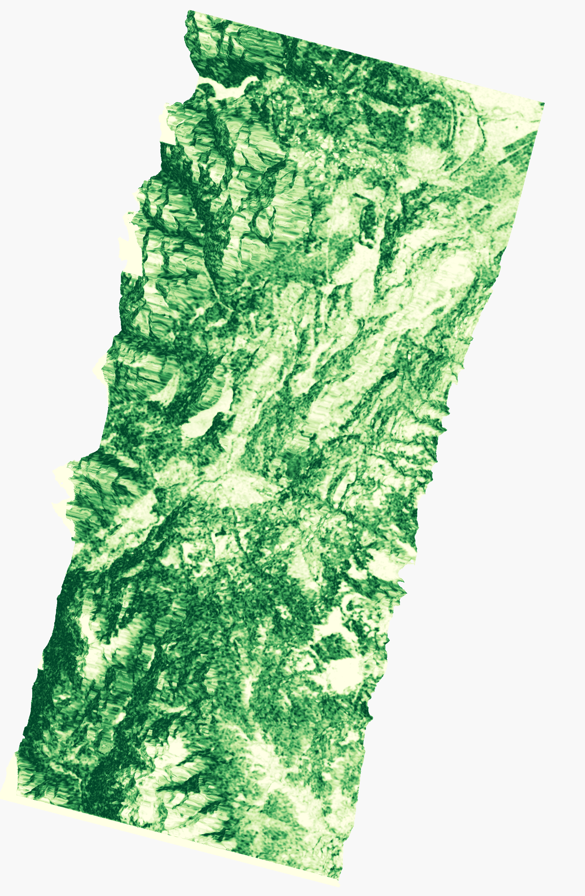
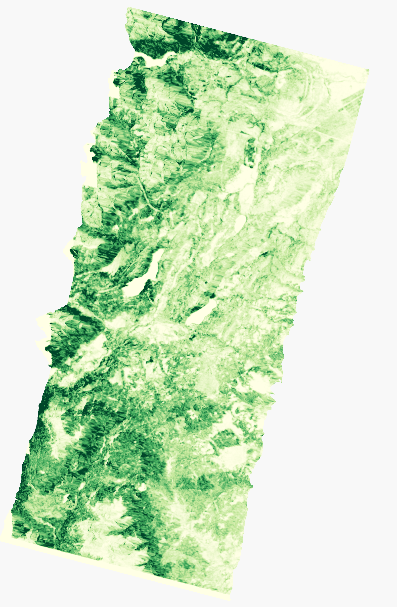
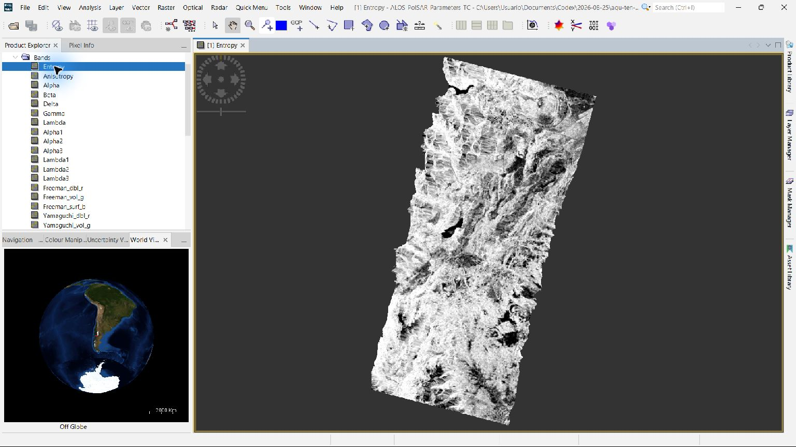

> **Nota de esta carpeta:** el proceso se hizo sobre la **imagen completa**,
> no sobre los recintos. Queda pendiente repetirlo por AOI para reducir el
> volumen de trabajo.

  -----------------------------------------------------------------------

  -----------------------------------------------------------------------

**GUÍA PRÁCTICA DE POSGRADO**

Procesamiento polarimétrico\
de ALOS PALSAR-1 en SNAP

**De una escena SLC quad-pol a parámetros, descomposiciones,
ortorrectificación y variables candidatas para biomasa**

  -----------------------------------------------------------------------
  **Escena real**                     **Configuración**
  ----------------------------------- -----------------------------------
  ALPSRP079284470 · Nivel 1.1 ·       Banda L · HH/HV/VH/VV · 30 m ·
  21/07/2007                          EPSG:32719

  Centro aproximado: 42,479° S;       SNAP 14 / GPT · Copernicus DEM 30 m
  71,397° O                           
  -----------------------------------------------------------------------

  ------------------------------------------------------------------------
     **Alcance ---** Esta guía documenta una ejecución real sobre el
     archivo entregado. Los números presentados son estadísticos de la
     escena procesada; no son valores bibliográficos ni una estimación de
     biomasa sin calibración de campo.
  -- ---------------------------------------------------------------------

  ------------------------------------------------------------------------

**Material docente · Teledetección por radar**

# Cómo usar esta guía

El documento está diseñado para que un estudiante pueda repetir el flujo
en la interfaz gráfica de SNAP y, al mismo tiempo, comprender qué
magnitud física produce cada operador. Cada etapa indica entrada, menú,
parámetros, salida, unidades y un control de calidad mínimo.

  ------------------------------------------------------------------------
     **Lectura recomendada ---** Primero recorra las secciones 1--4.
     Después ejecute los pasos 5--13 sin alterar el orden. Finalmente
     interprete los resultados con las reglas de las secciones 14--19.
  -- ---------------------------------------------------------------------

  ------------------------------------------------------------------------

## Resultados de aprendizaje

-   Distinguir SLC complejo, potencia calibrada, matrices polarimétricas
    > y productos geocodificados.

-   Construir T3 y derivar H/A/α, Freeman--Durden, Yamaguchi y
    > parámetros escalares.

-   Reducir la dependencia radiométrica del relieve mediante Terrain
    > Flattening y corrección de orientación.

-   Reconocer foreshortening, layover y sombra; separar corrección
    > radiométrica de corrección geométrica.

-   Diseñar un modelo de biomasa validable sin confundir un índice
    > polarimétrico con biomasa observada.

## Convenciones

  -----------------------------------------------------------------------
  **Símbolo /       **Uso en la guía**
  término**         
  ----------------- -----------------------------------------------------
  Potencia lineal   Magnitud proporcional a \|S\|²; sin unidad física
                    absoluta.

  dB                10·log₁₀(potencia).

  Adimensional      Índice, cociente o coherencia; se reporta sin unidad.

  p05--p95          Intervalo que contiene el 90 % central de los píxeles
                    válidos.

  Resultado         Valor calculado sobre esta escena; no debe
  observado         extrapolarse automáticamente.
  -----------------------------------------------------------------------

# 1. Datos de entrada y diagnóstico

  -----------------------------------------------------------------------
  **Campo**               **Valor verificado**
  ----------------------- -----------------------------------------------
  Sensor / misión         ALOS PALSAR-1 · banda L

  Producto                CEOS Level 1.1, SLC complejo

  Modo                    Stripmap quad-pol

  Canales                 HH, HV, VH, VV

  Tamaño original         1 248 muestras × 18 432 líneas

  Hora UTC                14:31:20.062--14:31:29.758

  Órbita absoluta         7 928; mirada derecha

  Off-nadir               21,5°

  Incidencia elipsoidal   22,79°--25,01°

  Cobertura aproximada    Andes patagónicos; relieve abrupto
  -----------------------------------------------------------------------

**Figura 1. Metadatos abstractos de la escena original abiertos en
SNAP.**

*Fuente: Procesamiento propio en SNAP; escena ALPSRP079284470.*

  ------------------------------------------------------------------------
     **Implicación ---** Un ángulo de observación bajo sobre pendientes
     fuertes intensifica foreshortening y puede producir layover. La
     ortorrectificación ubica los píxeles, pero no recupera información
     que no fue observada en sombra ni desenreda retornos superpuestos.
  -- ---------------------------------------------------------------------

  ------------------------------------------------------------------------

# 2. Qué "se ve horrible" y por qué

  ----------------------------------------------------------------------------
  **Efecto**       **Geometría**         **Aspecto en la       **¿Se
                                         imagen**              corrige?**
  ---------------- --------------------- --------------------- ---------------
  Foreshortening   Pendiente orientada   Laderas comprimidas y Se reposiciona
                   al radar; la cima     excesivamente         con DEM, pero
                   llega casi junto al   brillantes.           la resolución
                   pie.                                        terrestre ya
                                                               está degradada.

  Layover          La cima llega antes   Orden espacial        No se
                   que el pie.           invertido; mezcla de  reconstruye con
                                         dispersores.          una sola
                                                               órbita; se
                                                               enmascara.

  Sombra radar     La ladera queda       Zona oscura sin señal No: es ausencia
                   oculta al haz.        útil.                 de observación;
                                                               se enmascara.

  Modulación       La pendiente cambia   Diferencias de brillo Terrain
  radiométrica     el área iluminada por no atribuibles a      Flattening
                   píxel.                cobertura.            reduce el
                                                               sesgo, si DEM y
                                                               geometría son
                                                               adecuados.
  ----------------------------------------------------------------------------

## Separación conceptual imprescindible

  -----------------------------------------------------------------------
  **Radiometría**                     **Geometría**
  ----------------------------------- -----------------------------------
  Calibration convierte DN complejos  Terrain Correction geocodifica y
  a una magnitud calibrada.           reproyecta.

  Terrain Flattening normaliza el     Layover/sombra siguen siendo datos
  área iluminada usando el DEM.       no recuperables.

  Orientation Angle Correction reduce La máscara decide dónde no
  rotación inducida por pendiente en  interpretar.
  T3.                                 
  -----------------------------------------------------------------------

  ------------------------------------------------------------------------
     **Regla de oro ---** No interprete biomasa en píxeles con geometría
     extrema. Una imagen visualmente "más lisa" no es necesariamente más
     correcta.
  -- ---------------------------------------------------------------------

  ------------------------------------------------------------------------

# 3. Flujo completo y orden de operadores

El orden preserva la información compleja mientras es necesaria, reduce
ruido antes de estimar mecanismos de dispersión y evita aplicar dos
veces una normalización radiométrica.

  ---------------------------------------------------------------------------
  **\#**   **Operador**                **Producto lógico**
  -------- --------------------------- --------------------------------------
  1        Read CEOS                   SLC HH/HV/VH/VV

  2        Calibration                 Beta0 compleja

  3        ALOS Deskewing              Geometría azimutal corregida

  4        Multilook                   Píxel aproximadamente cuadrado

  5        Polarimetric Matrices       T3

  6        Terrain Flattening          T3 normalizada por terreno

  7        Refined Lee                 T3 filtrada

  8        Orientation Angle           T3 orientada
           Correction                  

  9        Descomposiciones + índices  43 bandas temáticas

  10       Range-Doppler TC            UTM 19S, 30 m
  ---------------------------------------------------------------------------

  ------------------------------------------------------------------------
     **Punto de decisión ---** Para análisis polarimétrico conserve la
     matriz T3 en potencia lineal. Use dB principalmente para
     visualización y para modelos que hayan sido calibrados explícitamente
     en dB.
  -- ---------------------------------------------------------------------

  ------------------------------------------------------------------------

## Archivos obtenidos

  --------------------------------------------------------------------------
  **Producto**                    **Dimensiones / contenido**
  ------------------------------- ------------------------------------------
  ALOS_T3_RTC_Lee_OAC.dim         1 248 × 3 072; T11...T33 + Ori_Ang

  ALOS_PolSAR_Parameters_TC.dim   1 597 × 2 441; 43 bandas; EPSG:32719; 30 m

  Estadísticas auxiliares         CSV y JSON con percentiles y unidades

  Figuras                         Mapas temáticos y capturas reales de SNAP
  --------------------------------------------------------------------------

# 4. Preparación del proyecto SNAP

## Paso 1 · Importar CEOS Level 1.1

  -----------------------------------------------------------------------
  **Propósito**        **Ruta en SNAP**
  -------------------- --------------------------------------------------
  Leer la estructura   File › Open Product... y seleccionar
  CEOS completa sin    VOL-ALPSRP079284470-P1.1\_\_D
  separar los canales. 

  -----------------------------------------------------------------------

### Parámetros usados en esta ejecución

-   No abrir un IMG-HH/HV/VH/VV aislado.

-   Confirmar Product Type = SLC y cuatro polarizaciones.

-   Revisar Abstracted Metadata, rango de incidencia y órbita.

**Salida:** Producto lógico con bandas I/Q de HH, HV, VH y VV.

**Control de calidad:** Las cuatro polarizaciones deben compartir tamaño
y geometría; el producto debe identificarse como ALOS PALSAR.

**Figura 2. Control inicial de metadatos en SNAP.**

*Fuente: Procesamiento propio en SNAP; escena ALPSRP079284470.*

# 5. Calibración radiométrica compleja

## Paso 2 · Calibration

  -----------------------------------------------------------------------
  **Propósito**        **Ruta en SNAP**
  -------------------- --------------------------------------------------
  Convertir DN         Radar › Radiometric › Calibrate...
  complejos en         
  retrodispersión      
  calibrada            
  conservando fase     
  relativa.            

  -----------------------------------------------------------------------

### Parámetros usados en esta ejecución

-   Output image in complex = activado.

-   Output Beta0 band = activado.

-   Seleccionar HH, HV, VH y VV.

-   No generar Sigma0/Gamma0 adicionales en esta rama.

**Salida:** Bandas Beta0 complejas por polarización. Potencia: lineal;
amplitudes I/Q: unidades relativas calibradas.

**Control de calidad:** En zonas homogéneas no debe aparecer un patrón
de franjas o canales desplazados.

  ------------------------------------------------------------------------
     **Por qué Beta0 ---** El aplanamiento radiométrico del terreno
     necesita una magnitud referida a slant range. Aplicar luego Terrain
     Flattening evita confundir área iluminada con cobertura.
  -- ---------------------------------------------------------------------

  ------------------------------------------------------------------------

# 6. Deskewing y multilook

## Paso 3 · ALOS Deskewing

  -----------------------------------------------------------------------
  **Propósito**        **Ruta en SNAP**
  -------------------- --------------------------------------------------
  Compensar el sesgo   Radar › Geometric › ALOS Deskewing
  propio de la         
  geometría de ALOS    
  antes de             
  geocodificar.        

  -----------------------------------------------------------------------

### Parámetros usados en esta ejecución

-   DEM = Copernicus 30 m.

-   Interpolación DEM = bilinear.

**Salida:** Producto SLC deskewed.

**Control de calidad:** Comparar bordes y evitar líneas nulas
introducidas por un DEM sin cobertura.

## Paso 4 · Multilook

  -----------------------------------------------------------------------
  **Propósito**        **Ruta en SNAP**
  -------------------- --------------------------------------------------
  Reducir varianza de  Radar › SAR Utilities › Multilooking...
  speckle y obtener    
  muestreo             
  aproximadamente      
  cuadrado.            

  -----------------------------------------------------------------------

### Parámetros usados en esta ejecución

-   GR Square Pixel = activado.

-   Resultado efectivo: 6 looks en azimut.

-   Dimensiones: 1 248 × 3 072.

**Salida:** SLC multilook; resolución espacial menor, estabilidad
estadística mayor.

**Control de calidad:** Confirmar que no se haya perdido ninguna
polarización y que el píxel sea aproximadamente cuadrado.

  ------------------------------------------------------------------------
     **Trade-off ---** Más looks reducen speckle, pero borran estructuras
     pequeñas. Para biomasa, el tamaño de ventana debe ser menor que la
     escala de heterogeneidad que se quiere estudiar.
  -- ---------------------------------------------------------------------

  ------------------------------------------------------------------------

# 7. Matriz T3 y normalización del relieve

## Paso 5 · Polarimetric Matrices

  -----------------------------------------------------------------------
  **Propósito**        **Ruta en SNAP**
  -------------------- --------------------------------------------------
  Transformar los      Radar › Polarimetric › Polarimetric Matrix
  canales complejos en Generation
  la matriz de         
  coherencia de Pauli. 

  -----------------------------------------------------------------------

### Parámetros usados en esta ejecución

-   Matrix = T3.

-   Convención reciproca monostática; HV y VH deben ser coherentes.

**Salida:** T11, T12 real/imag, T13 real/imag, T22, T23 real/imag, T33.
Potencia lineal.

**Control de calidad:** T3 debe ser hermítica y semidefinida positiva
dentro de tolerancia numérica.

**Vector de Pauli:** kₚ = \[Sᴴᴴ+Sⱽⱽ, Sᴴᴴ−Sⱽⱽ, 2Sᴴⱽ\]ᵀ/√2; T3 = ⟨kₚ kₚᴴ⟩.

## Paso 6 · Terrain Flattening

  -----------------------------------------------------------------------
  **Propósito**        **Ruta en SNAP**
  -------------------- --------------------------------------------------
  Compensar la         Radar › Radiometric › Terrain Flattening...
  modulación           
  radiométrica causada 
  por el área          
  iluminada sobre el   
  DEM.                 

  -----------------------------------------------------------------------

### Parámetros usados en esta ejecución

-   DEM = Copernicus 30 m.

-   DEM resampling = bilinear.

-   Additional overlap = 0,15.

-   Oversampling multiple = 1.

**Salida:** T3 radiométricamente aplanada. Potencia lineal.

**Control de calidad:** Comparar laderas opuestas de cobertura similar;
la diferencia sistemática debería reducirse, no desaparecer por
completo.

  ------------------------------------------------------------------------
     **DEM empleado ---** La ejecución reportada usó Copernicus 30 m por
     compatibilidad nativa y manejo automático del geoide. El FABDEM local
     puede ensayarse como alternativa bare-earth, pero obliga a documentar
     datum vertical y remuestreo.
  -- ---------------------------------------------------------------------

  ------------------------------------------------------------------------

# 8. Filtrado polarimétrico y orientación

## Paso 7 · Polarimetric Speckle Filter

  -----------------------------------------------------------------------
  **Propósito**        **Ruta en SNAP**
  -------------------- --------------------------------------------------
  Reducir speckle      Radar › Polarimetric › Polarimetric Speckle
  preservando la       Filter...
  estructura de la     
  matriz y los bordes. 

  -----------------------------------------------------------------------

### Parámetros usados en esta ejecución

-   Filter = Refined Lee.

-   Filter size = 5.

-   Window = 7 × 7.

**Salida:** T3 filtrada.

**Control de calidad:** Evitar aplicar un filtro independiente a cada
banda: puede destruir coherencias y positividad de la matriz.

## Paso 8 · Orientation Angle Correction

  -----------------------------------------------------------------------
  **Propósito**        **Ruta en SNAP**
  -------------------- --------------------------------------------------
  Compensar la         Radar › Polarimetric › Polarimetric Tools ›
  rotación del plano   Orientation Angle Correction
  de polarización      
  inducida por         
  pendiente y          
  orientación del      
  terreno.             

  -----------------------------------------------------------------------

### Parámetros usados en esta ejecución

-   Output orientation angle = activado.

**Salida:** T3 corregida + Ori_Ang, en radianes.

**Control de calidad:** Cambios fuertes en potencia cruzada sobre
laderas indican que la topografía afectaba la interpretación de volumen.

  ------------------------------------------------------------------------
     **Importante ---** La corrección de orientación no elimina layover ni
     sombra. Corrige una rotación polarimétrica; no reconstruye la
     geometría radar.
  -- ---------------------------------------------------------------------

  ------------------------------------------------------------------------

# 9. Descomposiciones polarimétricas

## Paso 9A · H/A/α

  -----------------------------------------------------------------------
  **Propósito**        **Ruta en SNAP**
  -------------------- --------------------------------------------------
  Caracterizar         Radar › Polarimetric › Polarimetric Decomposition
  aleatoriedad,        
  importancia relativa 
  de autovalores y     
  mecanismo medio.     

  -----------------------------------------------------------------------

### Parámetros usados en esta ejecución

-   Decomposition = H-Alpha Dual/Quad Pol.

-   Window size = 5.

**Salida:** Entropy, Anisotropy, Alpha y autovalores/autovectores. H y A
adimensionales; α, β, δ, γ en grados.

**Control de calidad:** H debe estar aproximadamente en \[0,1\]; α medio
en \[0°,90°\].

## Paso 9B · Freeman--Durden

  -----------------------------------------------------------------------
  **Propósito**        **Ruta en SNAP**
  -------------------- --------------------------------------------------
  Separar potencia de  Radar › Polarimetric › Polarimetric Decomposition
  superficie, doble    
  rebote y volumen     
  aleatorio.           

  -----------------------------------------------------------------------

### Parámetros usados en esta ejecución

-   Decomposition = Freeman-Durden.

-   Window size = 5.

**Salida:** Freeman_surf_b, Freeman_dbl_r, Freeman_vol_g; SNAP los
exportó en dB.

**Control de calidad:** No interpretar potencia de volumen como biomasa
sin calibración; pendiente residual puede aumentar el canal de volumen.

## Paso 9C · Yamaguchi

  -----------------------------------------------------------------------
  **Propósito**        **Ruta en SNAP**
  -------------------- --------------------------------------------------
  Añadir componente    Misma ruta; seleccionar Yamaguchi
  helicoidal y         
  flexibilizar la      
  representación de    
  volumen.             

  -----------------------------------------------------------------------

### Parámetros usados en esta ejecución

-   Window size = 5.

**Salida:** Superficie, doble rebote, volumen y helix; dB.

**Control de calidad:** La componente helix alta puede indicar
asimetría/estructura compleja, pero también ruido y heterogeneidad.

# 10. Parámetros escalares e índices de vegetación

## Paso 10 · Polarimetric Parameters

  -----------------------------------------------------------------------
  **Propósito**        **Ruta en SNAP**
  -------------------- --------------------------------------------------
  Calcular magnitudes  Radar › Polarimetric › Polarimetric Parameters
  compactas para       
  exploración,         
  clasificación o      
  modelos posteriores. 

  -----------------------------------------------------------------------

### Parámetros usados en esta ejecución

-   Use mean matrix = activado.

-   Window size = 5 × 5.

-   Activar Span, Pedestal Height, RVI, RFDI, CSI, VSI, BMI, ITI,
    > ratios, coherencias y fases.

**Salida:** Conjunto de parámetros escalares.

**Control de calidad:** Verificar rango, unidades y valores extremos.
Las coherencias \>1 son numéricamente inválidas y deben filtrarse; en
esta escena el p99 permanece \<1.

## Paso 11 · Generalized RVI

  -----------------------------------------------------------------------
  **Propósito**        **Ruta en SNAP**
  -------------------- --------------------------------------------------
  Obtener un índice    Radar › Polarimetric › Generalized Radar
  polarimétrico de     Vegetation Index
  vegetación más       
  estable para         
  quad-pol.            

  -----------------------------------------------------------------------

### Parámetros usados en esta ejecución

-   Window size = 5.

**Salida:** GRVI adimensional.

**Control de calidad:** Interpretar como descriptor de
aleatoriedad/vegetación, no como biomasa directa.

  ------------------------------------------------------------------------
     **Advertencia RVI ---** El operador RVI general produjo valores del
     orden de 10⁻⁴ en esta cadena T3, mientras GRVI tuvo mediana 0,468.
     Esto indica una diferencia de definición/normalización del operador:
     para docencia y modelado debe auditarse la fórmula antes de usar RVI
     como predictor.
  -- ---------------------------------------------------------------------

  ------------------------------------------------------------------------

# 11. Geocodificación final y bandas geométricas

## Paso 12 · Range-Doppler Terrain Correction

  -----------------------------------------------------------------------
  **Propósito**        **Ruta en SNAP**
  -------------------- --------------------------------------------------
  Ortorrectificar      Radar › Geometric › Terrain Correction ›
  todas las bandas y   Range-Doppler Terrain Correction
  llevarlas a una      
  grilla cartográfica  
  común.               

  -----------------------------------------------------------------------

### Parámetros usados en esta ejecución

-   DEM = Copernicus 30 m.

-   Map projection = WGS 84 / UTM 19S (EPSG:32719).

-   Pixel spacing = 30 m.

-   Image/DEM resampling = bilinear.

-   Guardar elevation, local incidence, projected local incidence,
    > ellipsoid incidence y layover-shadow mask.

-   Radiometric normalization = desactivada: ya se aplicó Terrain
    > Flattening.

**Salida:** 1 597 × 2 441; 30 × 30 m; 43 bandas.

**Control de calidad:** Comprobar CRS, tamaño de píxel, cobertura DEM y
bordes. No remuestrear máscaras categóricas con interpolación continua
en exportaciones posteriores.

**Figura 3. Producto final abierto en SNAP; se observan las bandas H/A/α
y las descomposiciones.**

*Fuente: Procesamiento propio en SNAP; escena ALPSRP079284470.*

# 12. Resultado cartográfico general

  -----------------------------------------------------------------------
  **Magnitud**            **Resultado observado**
  ----------------------- -----------------------------------------------
  Extensión con datos     ≈ 1 879,45 km² (2 088 281 píxeles de 900 m²)

  Elevación DEM           p05 554 m; mediana 914 m; p95 1 608 m; máximo 2
                          137 m

  Incidencia elipsoidal   p05 22,91°; mediana 23,94°; p95 24,89°

  Incidencia local        p05 12,38°; mediana 25,22°; p95 49,52°; máximo
                          91,27°

  Incidencia local        p05 5,34°; mediana 24,26°; p95 46,57°; máximo
  proyectada              91,27°
  -----------------------------------------------------------------------

  ------------------------------------------------------------------------
     **Lectura geométrica ---** La amplia dispersión entre incidencia
     elipsoidal y local confirma que el relieve domina la geometría. Los
     valores cercanos a 0° o 90° son de baja confiabilidad para
     interpretación biofísica.
  -- ---------------------------------------------------------------------

  ------------------------------------------------------------------------

**Figura 4. Composición Freeman--Durden: R = doble rebote, G = volumen,
B = superficie.**

*Fuente: Procesamiento propio en SNAP; escena ALPSRP079284470.*

# 13. H/A/α: resultados e interpretación

**Figura 5. Entropía polarimétrica H, adimensional.**

*Fuente: Procesamiento propio en SNAP; escena ALPSRP079284470.*

**Figura 6. Ángulo α medio, en grados.**

*Fuente: Procesamiento propio en SNAP; escena ALPSRP079284470.*

  -----------------------------------------------------------------------------------------
  **Parámetro**   **p05**   **Mediana**   **Media**   **p95**   **Lectura prudente**
  --------------- --------- ------------- ----------- --------- ---------------------------
  Entropy H       0,303     0,753         0,698       0,919     Predominio de dispersión
                                                                heterogénea en gran parte
                                                                de la escena.

  Anisotropy A    0,130     0,215         0,221       0,341     Segundo y tercer autovalor
                                                                relativamente próximos; A
                                                                aporta sobre todo cuando H
                                                                es alto.

  Alpha           11,78°    31,24°        30,13°      45,17°    Mecanismo medio entre
                                                                superficie y volumen; el
                                                                relieve exige máscara.

  Pedestal height 0,033     0,175         0,182       0,361     Fracción de potencia no
                                                                polarizada/modo débil;
                                                                indicador de complejidad.
  -----------------------------------------------------------------------------------------

  ------------------------------------------------------------------------
     **Interpretación conjunta ---** H alta con α intermedio es compatible
     con vegetación estructuralmente compleja, pero no prueba por sí sola
     bosque ni biomasa alta. Agua rugosa, relieve y mezclas también pueden
     producir respuestas complejas.
  -- ---------------------------------------------------------------------

  ------------------------------------------------------------------------

# 14. Potencias de dispersión

**Figura 7. Potencia de volumen Freeman--Durden, en dB.**

*Fuente: Procesamiento propio en SNAP; escena ALPSRP079284470.*

  --------------------------------------------------------------------------------
  **Componente**      **p05**   **Mediana**   **Media**   **p95**   **Unidad**
  ------------------- --------- ------------- ----------- --------- --------------
  Freeman volumen     −24,85    −17,27        −17,93      −13,35    dB

  Freeman superficie  −24,47    −18,43        −20,30      −13,57    dB

  Freeman doble       −34,24    −27,03        −28,26      −22,46    dB
  rebote                                                            

  Yamaguchi helix     −44,42    −32,27        −35,19      −25,05    dB

  Span                0,029     0,075         0,084       0,160     potencia
                                                                    lineal
  --------------------------------------------------------------------------------

La componente de volumen es la más alta en mediana entre las tres de
Freeman, consistente con una contribución volumétrica extendida. Sin
embargo, la comparación se hace en dB y no debe convertirse en
porcentaje sumando directamente valores logarítmicos.

  ------------------------------------------------------------------------
     **Para porcentajes ---** Transforme cada componente dB a potencia
     lineal, calcule Pᵢ/(Psurf+Pdbl+Pvol) y recién entonces exprese la
     fracción en %.
  -- ---------------------------------------------------------------------

  ------------------------------------------------------------------------

# 15. Índices candidatos para vegetación

**Figura 8. Generalized Radar Vegetation Index (GRVI), adimensional.**

*Fuente: Procesamiento propio en SNAP; escena ALPSRP079284470.*

**Figura 9. RVI del operador Polarimetric Parameters; escala propia
observada.**

*Fuente: Procesamiento propio en SNAP; escena ALPSRP079284470.*

  -----------------------------------------------------------------------------
  **Índice**   **p05**     **Mediana**   **p95**     **Uso recomendado**
  ------------ ----------- ------------- ----------- --------------------------
  GRVI         0,096       0,468         0,804       Exploración y predictor
                                                     candidato, después de
                                                     controlar geometría.

  RVI          2,67×10⁻⁵   2,07×10⁻⁴     5,40×10⁻⁴   No usar hasta verificar
                                                     definición/normalización
                                                     del operador.

  BMI          0,080       0,127         0,193       Descriptor de balance de
                                                     mecanismos; potencia
                                                     lineal.

  CSI          0,436       0,492         0,538       Descriptor adimensional;
                                                     interpretar con
                                                     documentación del
                                                     operador.
  -----------------------------------------------------------------------------

  ------------------------------------------------------------------------
     **Principio pedagógico ---** Un índice no "calcula biomasa". Resume
     una propiedad de la matriz polarimétrica. La biomasa requiere una
     relación empírica o física calibrada y validada con datos
     independientes.
  -- ---------------------------------------------------------------------

  ------------------------------------------------------------------------

# 16. Control de calidad geométrico

**Figura 10. Visualización real de Entropy en SNAP después de la
corrección de terreno.**

*Fuente: Procesamiento propio en SNAP; escena ALPSRP079284470.*

  -----------------------------------------------------------------------------------
  **Banda**                      **Unidad**   **Qué controla**
  ------------------------------ ------------ ---------------------------------------
  elevation                      m            Cobertura y coherencia del DEM usado.

  incidenceAngleFromEllipsoid    grados       Geometría nominal del sensor.

  localIncidenceAngle            grados       Ángulo entre línea de vista y normal
                                              local.

  projectedLocalIncidenceAngle   grados       Geometría proyectada en el plano de
                                              alcance; útil para detectar extremos.

  layoverShadowMask              bit/código   0 válido, 1 layover, 2 sombra, 3 ambos;
                                              revisar siempre.
  -----------------------------------------------------------------------------------

  ------------------------------------------------------------------------
     **Resultado anómalo de la máscara ---** La banda solicitada a SNAP
     quedó en código 0 en toda la huella, pese a incidencias locales de
     hasta 91,27°. Por lo tanto, no se la considera una máscara confiable
     en esta ejecución. Debe regenerarse desde el SLC/DEM en una rama
     geométrica separada o construirse una máscara conservadora con
     incidencia local y pendiente.
  -- ---------------------------------------------------------------------

  ------------------------------------------------------------------------

## Máscara conservadora propuesta

  -----------------------------------------------------------------------
  valid_geom = (projectedLocalIncidenceAngle \>= 10°) AND\
  (projectedLocalIncidenceAngle \<= 60°) AND\
  (localIncidenceAngle \> 0°) AND (localIncidenceAngle \< 90°)\
  \
  \# Ajustar umbrales con inspección visual y, si existe, un mapa
  independiente de layover/sombra.
  -----------------------------------------------------------------------

  -----------------------------------------------------------------------

## Cómo regenerar y auditar la máscara

-   Crear una rama independiente desde el producto SLC deskewed, antes
    > de fusionar las bandas temáticas.

-   Ejecutar Range-Doppler Terrain Correction con el mismo DEM,
    > proyección y espaciado, solicitando la máscara layover/sombra.

-   Comparar la máscara con incidencia local, pendiente/aspecto del DEM
    > y una composición de amplitud.

-   Distinguir NoData exterior de sombra radar; ambos pueden verse
    > oscuros, pero no representan el mismo fenómeno.

-   Aplicar la máscara categórica con vecino más próximo y documentar el
    > porcentaje excluido.

  -----------------------------------------------------------------------
  **Condición          **Tratamiento**
  indicativa**         
  -------------------- --------------------------------------------------
  PLIA \< 10°          Marcar como geometría frontal extrema;
                       inspeccionar posible layover/foreshortening.

  PLIA \> 60°          Marcar como incidencia rasante; inspeccionar
                       sombra y bajo SNR.

  LIA ≤ 0° o ≥ 90°     Excluir de análisis biofísico.

  Máscara SNAP = 1, 2  Excluir y conservar el código para distinguir la
  o 3                  causa.
  -----------------------------------------------------------------------

# 17. ¿Se puede calcular biomasa?

Sí se pueden calcular variables polarimétricas relacionadas con
estructura y contenido de vegetación. No se obtiene biomasa aérea (AGB,
Mg·ha⁻¹) de manera universal con un botón de SNAP. Hace falta un modelo
calibrado con parcelas, lidar o un producto de referencia compatible.

  -------------------------------------------------------------------------------
  **Nivel**       **Producto**            **Unidad**      **Estado**
  --------------- ----------------------- --------------- -----------------------
  1\. Observable  Potencia calibrada,     lineal, dB, rad Calculado
  SAR             coherencias, fases                      

  2\. Descriptor  H/A/α, GRVI, fracciones adimensional,   Calculado
  polarimétrico   Freeman/Yamaguchi       grados, dB      

  3\. Predictor   Variables enmascaradas, según variable  Debe construirse
  preparado       agregadas a parcela y                   
                  controladas por                         
                  geometría                               

  4\. Biomasa     Salida de un modelo     Mg·ha⁻¹         No calculada: faltan
  estimada        calibrado                               datos de referencia

  5\.             RMSE, MAE, sesgo,       Mg·ha⁻¹, %      Obligatoria para
  Incertidumbre   intervalos                              reportar AGB
  -------------------------------------------------------------------------------

## Modelo didáctico general

  -----------------------------------------------------------------------
  ln(AGB + 1) = β₀ + β₁·Pvol + β₂·GRVI + β₃·H + β₄·γ⁰_HV + β₅·θ_local +
  ε\
  \
  AGB: Mg·ha⁻¹ Pvol, γ⁰_HV: usar una escala consistente θ_local: grados\
  Los coeficientes β se ajustan con parcelas; no se transfieren sin
  validación.
  -----------------------------------------------------------------------

  -----------------------------------------------------------------------

  ------------------------------------------------------------------------
     **Saturación ---** La banda L suele ser más sensible a biomasa que C,
     pero también satura en bosques densos. El umbral depende de
     estructura, humedad, incidencia, resolución y modelo; no use un valor
     de saturación único sin evidencia local.
  -- ---------------------------------------------------------------------

  ------------------------------------------------------------------------

# 18. Protocolo de modelado de biomasa

1.  Definir la variable objetivo: AGB seca sobre el suelo en Mg·ha⁻¹ y
    fecha de referencia.

2.  Depurar parcelas: geolocalización, área mínima, compatibilidad
    temporal y distancia a bordes.

3.  Aplicar máscara geométrica y excluir agua, urbano, nieve/hielo y
    píxeles sin DEM.

4.  Convertir las potencias a una escala coherente; nunca mezclar dB y
    lineal dentro de una suma física.

5.  Agregar píxeles al soporte de parcela mediante media/mediana robusta
    y registrar dispersión interna.

6.  Separar espacialmente entrenamiento y validación para evitar fuga
    por autocorrelación.

7.  Comparar modelo parsimonioso, random forest/boosting y, si procede,
    modelo físico-semíempírico.

8.  Reportar R², RMSE, MAE, sesgo, gráfico observado--predicho y
    residuales por incidencia/pendiente.

9.  Propagar incertidumbre y declarar rango de AGB soportado por las
    parcelas.

## Variables iniciales razonables

  -----------------------------------------------------------------------
  **Grupo**      **Candidatas**
  -------------- --------------------------------------------------------
  Potencias      γ⁰_HH, γ⁰_HV, γ⁰_VV; Span; Freeman/Yamaguchi en lineal

  Estructura     Entropy, Alpha, Anisotropy, Pedestal Height

  Vegetación     GRVI y fracción de volumen

  Relaciones     HH/VV, HH/HV, VV/VH, coherencias válidas

  Control        Incidencia local, pendiente, elevación, clase de
                 cobertura
  -----------------------------------------------------------------------

# 19. Automatización con SNAP GPT

La interfaz gráfica es excelente para aprender y verificar. Para una
colección de escenas, los mismos operadores deben guardarse como graph
XML y ejecutarse con GPT. Las rutas se muestran como ejemplo
reproducible de esta ejecución.

## Cadena base: T3 normalizada, filtrada y orientada

  --------------------------------------------------------------------------------
  \"C:\\Program Files\\esa-snap11\\bin\\gpt.exe\" base_processing.xml -c 8G -q 12
  \^\
  -Dsnap.userdir=\"\...\\work\\alos_palsar\\snap_userdir\" \^\
  -Psource=\"\...\\source\\ALPSRP079284470-L1.1\\VOL-ALPSRP079284470-P1.1\_\_D\"
  \^\
  -Ptarget=\"\...\\products\\ALOS_T3_RTC_Lee_OAC.dim\"
  --------------------------------------------------------------------------------

  --------------------------------------------------------------------------------

## Derivados y geocodificación

  -----------------------------------------------------------------------
  \"C:\\Program Files\\esa-snap11\\bin\\gpt.exe\" derived_and_geocode.xml
  -c 12G -q 12 \^\
  -Dsnap.userdir=\"\...\\work\\alos_palsar\\snap_userdir\" \^\
  -Psource=\"\...\\products\\ALOS_T3_RTC_Lee_OAC.dim\" \^\
  -Ptarget=\"\...\\products\\ALOS_PolSAR_Parameters_TC.dim\"
  -----------------------------------------------------------------------

  -----------------------------------------------------------------------

  -----------------------------------------------------------------------
  **Opción**       **Significado**
  ---------------- ------------------------------------------------------
  -c 8G / 12G      Caché de memoria para teselas.

  -q 12            Número de hilos de procesamiento.

  -Dsnap.userdir   Directorio auxiliar reproducible: DEM, órbitas y
                   cachés.

  -Psource /       Parámetros sustituidos dentro del graph XML.
  -Ptarget         
  -----------------------------------------------------------------------

  ------------------------------------------------------------------------
     **Reproducibilidad ---** Archive graph XML, versión de SNAP, DEM,
     estadísticas y logs. Un cambio de DEM, ventana, filtro u operador
     puede alterar el modelo biofísico.
  -- ---------------------------------------------------------------------

  ------------------------------------------------------------------------

# 20. Tabla consolidada de resultados

Los siguientes números fueron calculados sobre la escena procesada. p05
y p95 delimitan el 90 % central de los píxeles considerados válidos por
banda; la mediana es el descriptor más robusto frente a colas y valores
extremos.

  ------------------------------------------------------------------------
     **Alcance estadístico ---** Se excluyeron el exterior de la huella,
     NoData y ceros de relleno. No se aplicó una máscara fiable de
     layover/sombra porque la banda automática quedó en cero; por eso
     estos valores describen la escena procesada, pero todavía pueden
     contener influencia topográfica.
  -- ---------------------------------------------------------------------

  ------------------------------------------------------------------------

## H/A/α y autovalores

  -------------------------------------------------------------------------------
  **Parámetro**     **Unidad**      **p05**   **Mediana**   **Media**   **p95**
  ----------------- --------------- --------- ------------- ----------- ---------
  Entropy           adimensional    0,303     0,753         0,698       0,919
                    \[0,1\]                                             

  Anisotropy        adimensional    0,130     0,215         0,221       0,341
                    \[0,1\]                                             

  Alpha             grados          11,781    31,238        30,130      45,175

  Alpha1            grados          1,993     5,681         6,729       14,964

  Alpha2            grados          76,510    85,524        84,465      88,824

  Alpha3            grados          82,375    87,325        86,767      89,270

  Beta              grados          16,080    32,116        33,723      56,582

  Delta             grados          -82,260   3,738         5,120       93,943

  Gamma             grados          -107,4    4,617         4,360       110,8

  Lambda            potencia lineal 0,009     0,019         0,023       0,047
                    (autovalor)                                         

  Lambda1           potencia lineal 0,011     0,025         0,029       0,058
                    (autovalor)                                         

  Lambda2           potencia lineal 0,001     0,007         0,008       0,017
                    (autovalor)                                         

  Lambda3           potencia lineal 7,88e−4   0,004         0,005       0,011
                    (autovalor)                                         

  PedestalHeight    adimensional    0,033     0,175         0,182       0,361

  Span              potencia lineal 0,029     0,075         0,084       0,160
  -------------------------------------------------------------------------------

  ------------------------------------------------------------------------
     **Lectura rápida ---** H = 0,753 y α = 31,24° en mediana: respuesta
     polarimétrica heterogénea con mecanismo medio entre superficie y
     volumen.
  -- ---------------------------------------------------------------------

  ------------------------------------------------------------------------

## Descomposiciones e índices

  --------------------------------------------------------------------------------
  **Parámetro**      **Unidad**      **p05**   **Mediana**   **Media**   **p95**
  ------------------ --------------- --------- ------------- ----------- ---------
  Freeman_surf_b     dB              -24,468   -18,426       -20,302     -13,573

  Freeman_dbl_r      dB              -34,240   -27,030       -28,259     -22,462

  Freeman_vol_g      dB              -24,854   -17,272       -17,931     -13,353

  Yamaguchi_surf_b   dB              -24,748   -18,231       -21,636     -13,494

  Yamaguchi_dbl_r    dB              -34,945   -26,989       -29,845     -22,430

  Yamaguchi_vol_g    dB              -26,723   -17,855       -21,061     -13,776

  Yamaguchi_hlx      dB              -44,420   -32,275       -35,186     -25,047

  GRVI               adimensional    0,096     0,468         0,458       0,804

  RVI                adimensional    2,67e−5   2,07e−4       2,37e−4     5,40e−4

  RFDI               adimensional    0,301     0,453         0,461       0,677

  CSI                adimensional    0,436     0,492         0,481       0,538

  VSI                adimensional    0,145     0,274         0,261       0,340

  BMI                potencia lineal 0,080     0,127         0,131       0,193
  --------------------------------------------------------------------------------

  ------------------------------------------------------------------------
     **Lectura rápida ---** Freeman volumen presenta mediana −17,27 dB y
     GRVI 0,468. BMI tiene mediana 0,127 en potencia lineal: no está
     expresado en Mg·ha⁻¹.
  -- ---------------------------------------------------------------------

  ------------------------------------------------------------------------

## Razones, coherencias, fases y geometría

  --------------------------------------------------------------------------------------------
  **Parámetro**                  **Unidad**      **p05**   **Mediana**   **Media**   **p95**
  ------------------------------ --------------- --------- ------------- ----------- ---------
  HHVVRatio                      razón           0,860     1,032         1,042       1,253
                                 adimensional                                        

  HHHVRatio                      razón           1,941     2,693         3,031       5,324
                                 adimensional                                        

  VVVHRatio                      razón           1,859     2,595         2,954       5,268
                                 adimensional                                        

  ITI                            razón           0,860     1,032         1,042       1,253
                                 adimensional                                        

  Coh_HHVV                       adimensional    0,279     0,580         0,582       0,883
                                 \[0,1\]                                             

  Coh_HHHV                       adimensional    0,076     0,171         0,182       0,321
                                 \[0,1\]                                             

  Coh_VVVH                       adimensional    0,077     0,173         0,184       0,324
                                 \[0,1\]                                             

  Phase_HHVV                     radianes        -0,406    0,012         0,005       0,388

  Phase_HHHV                     radianes        -2,241    -0,015        -0,018      2,221

  Phase_VVVH                     radianes        -2,204    0,131         0,090       2,260

  elevation                      m               554,0     913,6         981,4       1 607,5

  incidenceAngleFromEllipsoid    grados          22,911    23,938        23,924      24,891

  localIncidenceAngle            grados          12,380    25,220        27,535      49,518

  projectedLocalIncidenceAngle   grados          5,337     24,263        24,964      46,567
  --------------------------------------------------------------------------------------------

  ------------------------------------------------------------------------
     **Lectura rápida ---** La incidencia local varía mucho más que la
     incidencia elipsoidal, evidencia directa de la influencia del
     relieve.
  -- ---------------------------------------------------------------------

  ------------------------------------------------------------------------

# 20.1 Escala cualitativa: bajo, medio y alto

Una escala cualitativa es útil para comunicar resultados, siempre que se
diferencie entre una clasificación relativa a esta escena y una
clasificación con significado físico. Para los índices sin umbrales
universales se propone una regla robusta basada en cuartiles:

  ------------------------------------------------------------------------
  **Clase**    **Regla estadística**                 **Proporción
                                                     aproximada**
  ------------ ------------------------------------- ---------------------
  Bajo         valor \< percentil 25 (p25)           25 % inferior

  Medio        p25 ≤ valor ≤ p75                     50 % central

  Alto         valor \> percentil 75 (p75)           25 % superior
  ------------------------------------------------------------------------

  ------------------------------------------------------------------------
     **Interpretación correcta ---** "Alto" significa alto respecto de la
     distribución de esta imagen. No significa automáticamente mayor
     biomasa, mejor vegetación ni mayor calidad del dato. La dirección del
     significado depende del parámetro.
  -- ---------------------------------------------------------------------

  ------------------------------------------------------------------------

  -------------------------------------------------------------------------------
  **Parámetro**    **Bajo**   **Medio**      **Alto**   **Qué significa un valor
                                                        alto**
  ---------------- ---------- -------------- ---------- -------------------------
  Entropy          \< 0,606   0,606--0,841   \> 0,841   Mayor aleatoriedad y
                                                        mezcla de mecanismos.

  Anisotropy       \< 0,178   0,178--0,260   \> 0,260   Mayor diferencia relativa
                                                        entre los mecanismos
                                                        secundarios.

  PedestalHeight   \< 0,105   0,105--0,247   \> 0,247   Mayor componente débil/no
                                                        polarizada.

  GRVI             \< 0,273   0,273--0,646   \> 0,646   Respuesta relativamente
                                                        más compatible con
                                                        dispersión vegetal.

  RFDI             \< 0,390   0,390--0,534   \> 0,534   Mayor contraste entre
                                                        contribuciones co- y
                                                        cross-pol.

  CSI              \< 0,473   0,473--0,509   \> 0,509   Valor relativamente alto
                                                        del índice según SNAP.

  VSI              \< 0,231   0,231--0,305   \> 0,305   Mayor respuesta relativa
                                                        del índice vegetal.

  BMI              \< 0,106   0,106--0,149   \> 0,149   Mayor valor del
                                                        descriptor; no equivale a
                                                        AGB.

  Span             \< 0,052   0,052--0,104   \> 0,104   Mayor potencia
                                                        polarimétrica total.
  -------------------------------------------------------------------------------

## Escalas relativas de potencia, coherencia y razones

  ---------------------------------------------------------------------------------
  **Parámetro**    **Bajo**   **Medio**          **Alto**   **Qué significa un
                                                            valor alto**
  ---------------- ---------- ------------------ ---------- -----------------------
  Freeman_vol_g    \< -19,940 -19,940---15,269   \> -15,269 Mayor potencia de
                                                            dispersión volumétrica;
                                                            en dB, alto = menos
                                                            negativo.

  Freeman_surf_b   \< -20,193 -20,193---16,680   \> -16,680 Mayor potencia
                                                            atribuida a superficie.

  Freeman_dbl_r    \< -29,455 -29,455---25,035   \> -25,035 Mayor potencia
                                                            atribuida a doble
                                                            rebote.

  Coh_HHVV         \< 0,452   0,452--0,718       \> 0,718   Mayor
                                                            similitud/estabilidad
                                                            entre HH y VV.

  Coh_HHHV         \< 0,125   0,125--0,225       \> 0,225   Mayor correlación entre
                                                            co-pol y cross-pol.

  HHVVRatio        \< 0,963   0,963--1,109       \> 1,109   Mayor dominio relativo
                                                            de HH sobre VV.

  HHHVRatio        \< 2,308   2,308--3,342       \> 3,342   Mayor dominio relativo
                                                            de HH sobre HV.
  ---------------------------------------------------------------------------------

  ------------------------------------------------------------------------
     **Valores en dB ---** En una escala logarítmica, −14 dB representa
     mayor potencia que −22 dB. Para sumar mecanismos o calcular
     porcentajes, convertir primero a potencia lineal.
  -- ---------------------------------------------------------------------

  ------------------------------------------------------------------------

## Parámetros con interpretación física preferente

  ----------------------------------------------------------------------------
  **Parámetro**   **Intervalo**   **Interpretación**
  --------------- --------------- --------------------------------------------
  Entropy H       H \< 0,5        Entropía baja: un mecanismo relativamente
                                  dominante.

  Entropy H       0,5 ≤ H \< 0,9  Entropía media: mezcla moderada de
                                  mecanismos.

  Entropy H       H ≥ 0,9         Entropía alta: dispersión muy aleatoria.

  Alpha           0--40°          Superficie o dispersión de un rebote.

  Alpha           40--50°         Dipolo/volumen; frecuentemente compatible
                                  con vegetación.

  Alpha           50--90°         Dispersión múltiple o doble rebote.
  ----------------------------------------------------------------------------

En esta escena, la mediana de H fue 0,753: entropía media. La mediana de
Alpha fue 31,24°, mientras el p95 alcanzó 45,17°. Por ello domina el
dominio superficie--mezcla, aunque una fracción de los píxeles ingresa
al dominio volumétrico. H y Alpha deben interpretarse conjuntamente
mediante el plano H--α de Cloude--Pottier.

## Cómo leer las clases en esta escena

  ------------------------------------------------------------------------
     **Anisotropy y RVI ---** Anisotropy es más informativa cuando H es
     alta; con H baja los mecanismos secundarios aportan poco. El RVI
     obtenido presenta una escala anormalmente pequeña, por lo que no debe
     clasificarse hasta verificar la definición y normalización del
     operador.
  -- ---------------------------------------------------------------------

  ------------------------------------------------------------------------

  ---------------------------------------------------------------------------
  **Ejemplo**    **Clase / dominio**  **Lectura correcta**
  -------------- -------------------- ---------------------------------------
  Entropy = 0,70 Medio relativo;      Mezcla moderada de mecanismos, no
                 medio físico         "biomasa media".

  GRVI = 0,70    Alto relativo        Respuesta alta dentro de esta escena;
                                      requiere validación biofísica.

  Freeman        Alto relativo        Potencia volumétrica elevada respecto
  volumen = −14                       de la escena.
  dB                                  

  Coh_HHVV =     Alto relativo        HH y VV presentan similitud
  0,75                                relativamente alta.

  Alpha = 31°    Dominio              Alpha se clasifica por mecanismo, no
                 superficie--mezcla   como bajo/medio/alto.

  RVI = 2×10⁻⁴   No clasificar        Primero verificar fórmula y
                                      normalización del operador.
  ---------------------------------------------------------------------------

### Reglas para rotular mapas

-   Incluir en la leyenda los umbrales numéricos y la unidad, aunque el
    > producto sea adimensional.

-   Escribir "bajo/medio/alto relativo a la escena ALPSRP079284470".

-   No combinar clases de parámetros diferentes como si representaran la
    > misma magnitud.

-   Aplicar primero la máscara geométrica; los percentiles cambian si se
    > excluyen laderas problemáticas.

-   Si existen parcelas, reemplazar las clases relativas por intervalos
    > de AGB expresados en Mg·ha⁻¹.

# 21. Problemas frecuentes y solución

  ----------------------------------------------------------------------------
  **Síntoma**        **Causa probable**         **Acción**
  ------------------ -------------------------- ------------------------------
  El producto queda  Sólo se aplicó Terrain     Calibrar → Terrain Flattening
  muy brillante en   Correction.                antes de interpretar potencia.
  laderas                                       

  La biomasa sigue   Incidencia local /         OAC, máscara geométrica y
  el relieve         orientación no             diagnóstico de residuales por
                     controladas.               pendiente.

  Coherencia \> 1    Inestabilidad numérica,    Recortar a \[0,1\] sólo
                     borde o NoData.            después de auditar; excluir
                                                outliers.

  RVI casi cero      Definición/normalización   Revisar fórmula y calcular una
                     del operador incompatible  versión explícita desde T3.
                     con expectativa.           

  La máscara queda   Rama geométrica o          Regenerar máscara desde
  en cero            comportamiento del         SLC+DEM; usar
                     operador.                  incidencia/pediente como
                                                control.

  Descomposiciones   T3 no filtrada o filtro    Aplicar filtro polarimétrico
  con artefactos     por banda.                 matricial.

  Diferencias entre  DEM, versión, caché o      Fijar snap.userdir y archivar
  ejecuciones        parámetros distintos.      XML/logs.

  Imagen "bonita"    Estiramiento, suavizado o  Separar visualización de datos
  pero poco física   clasificación ocultan      analíticos y conservar
                     problemas.                 potencia original.
  ----------------------------------------------------------------------------

# 22. Actividad práctica para estudiantes

La actividad puede realizarse por equipos. Cada equipo conserva el mismo
producto base y modifica una sola decisión, de modo que el efecto
observado tenga una causa identificable.

  -----------------------------------------------------------------------------
  **Equipo**   **Experimento**      **Métrica**
  ------------ -------------------- -------------------------------------------
  A            Refined Lee 5 vs 7   Coeficiente de variación en un polígono
                                    homogéneo y preservación de bordes.

  B            Sin OAC vs con OAC   Cambio de Pvol y Alpha en laderas opuestas.

  C            Copernicus DEM vs    Diferencia de incidencia local y potencia
               FABDEM               aplanada.

  D            Ventana 3, 5 y 7     Sesgo/varianza de H, Alpha y GRVI.

  E            Con y sin máscara    Cambio en correlación entre predictores y
               conservadora         pendiente.
  -----------------------------------------------------------------------------

## Entrega mínima

-   Graph XML o capturas de todos los parámetros usados.

-   Tabla de unidades y percentiles p05, mediana y p95.

-   Dos mapas con la misma rampa y rango para comparación.

-   Una discusión explícita sobre qué información es irrecuperable.

-   Si se modela biomasa: validación espacial e incertidumbre en
    > Mg·ha⁻¹.

  ------------------------------------------------------------------------
     **Criterio de evaluación ---** Se evalúa la trazabilidad física y
     metodológica, no sólo la apariencia del mapa final.
  -- ---------------------------------------------------------------------

  ------------------------------------------------------------------------

# 23. Checklist final

  -----------------------------------------------------------------------
       **Control**
  ---- ------------------------------------------------------------------
  □    Producto CEOS completo; cuatro polarizaciones.

  □    Calibración compleja y escala documentada.

  □    Deskewing y multilook antes de T3.

  □    T3 generada y filtrada matricialmente.

  □    Terrain Flattening aplicada una sola vez.

  □    Orientation Angle Correction aplicada antes de interpretar
       volumen.

  □    Descomposiciones e índices con ventana registrada.

  □    Terrain Correction en CRS y píxel definidos.

  □    Máscara layover/sombra inspeccionada, no asumida.

  □    Incidencia local incluida en el control de calidad.

  □    Potencias dB convertidas a lineal para sumas o fracciones.

  □    Biomasa calibrada con datos de referencia y validación espacial.
  -----------------------------------------------------------------------

## Conclusión técnica

El flujo mejoró la comparabilidad radiométrica y produjo un conjunto
amplio de variables polarimétricas útiles. La escena conserva una señal
topográfica fuerte: la incidencia local llega a valores extremos y la
máscara automática no fue confiable. Por ello, los resultados son
adecuados para aprendizaje, exploración y construcción de predictores,
pero una estimación defendible de biomasa exige una máscara geométrica
regenerada, parcelas o referencia lidar, y validación independiente.

# Referencias

**1.** ESA STEP. ALOS PALSAR Orthorectification Tutorial.
https://step.esa.int/docs/tutorials/ALOS%20PALSAR%20Orthorectification%20Tutorial.pdf

**2.** ESA SNAP. Calibration Operator Help.
https://step.esa.int/main/wp-content/help/versions/10.0.0/snap-toolboxes/eu.esa.microwavetbx.sar.op.calibration.ui/operators/CalibrationOp.html

**3.** ESA SNAP. Terrain Flattening Operator Help.
https://step.esa.int/main/wp-content/help/versions/10.0.0/snap-toolboxes/eu.esa.microwavetbx.sar.op.sar.processing.ui/operators/TerrainFlatteningOp.html

**4.** ESA SNAP. Orientation Angle Correction Operator Help.
https://step.esa.int/main/wp-content/help/versions/12.0.0/snap-toolboxes/org.csa.rstb.rstb.op.polarimetric.tools.ui/operators/OrientationAngleCorrectionOp.html

**5.** ESA SNAP. Range-Doppler / SAR Simulation Terrain Correction
Operator Help, versiones 11--12.

**6.** Small, D. (2011). Flattening Gamma: Radiometric Terrain
Correction for SAR Imagery. IEEE Transactions on Geoscience and Remote
Sensing, 49(8), 3081--3093. https://doi.org/10.1109/TGRS.2011.2120616

**7.** Lee, J.-S., & Pottier, E. (2009). Polarimetric Radar Imaging:
From Basics to Applications. CRC Press.

**8.** Cloude, S. R. (2009). Polarisation: Applications in Remote
Sensing. Oxford University Press.
https://doi.org/10.1093/acprof:oso/9780199569731.001.0001

**9.** Freeman, A., & Durden, S. L. (1998). A Three-Component Scattering
Model for Polarimetric SAR Data. IEEE TGRS, 36(3), 963--973.

**10.** Yamaguchi, Y. et al. (2005). Four-Component Scattering Model for
Polarimetric SAR Image Decomposition. IEEE TGRS, 43(8), 1699--1706.

**11.** JAXA EORC. ALOS PALSAR product documentation and calibration
resources.

## Archivos de trazabilidad generados

  -----------------------------------------------------------------------------
  **Archivo**                   **Contenido**
  ----------------------------- -----------------------------------------------
  base_processing.xml           Cadena hasta T3 aplanada, filtrada y orientada.

  derived_and_geocode.xml       Descomposiciones, parámetros y geocodificación.

  estadisticas_parametros.csv   Estadísticos por banda.

  resultados.json               Resumen de raster y estadísticas.
  -----------------------------------------------------------------------------
